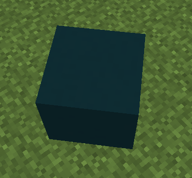
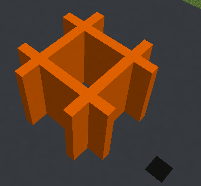
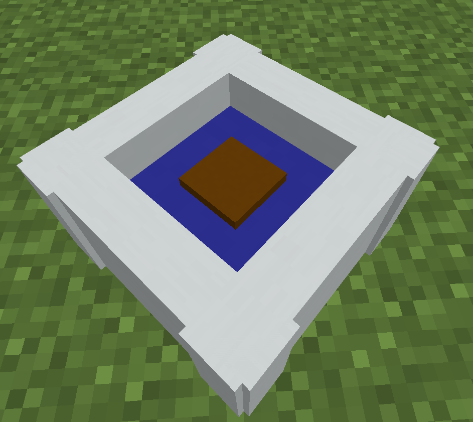

# DisplayModelLib
A library to help with the complexities of managing display entities & interactions.

### Adding DisplayModelLib to your project
1) Add the MetaMechanists repository.
```xml
<repository>
  <id>metamechanists-repo-releases</id>
  <name>MetaMechanists Repository</name>
  <url>https://repo.metamechanists.org/releases</url>
</repository>
```

2) Add DisplayModelLib as a dependency. You can find the latest version here https://repo.metamechanists.org/#/releases/org/metamechanists/DisplayModelLib
```xml
<dependency>
  <groupId>org.metamechanists</groupId>
  <artifactId>DisplayModelLib</artifactId>
  <version>2</version>
</dependency>
```

3) Shade DisplayModelLib into your plugin.

### Examples
#### Example 1
```java
new ModelBuilder()
    .add("main", new ModelCuboid()
            .material(Material.LIGHT_BLUE_CONCRETE)
            .brightness(3)
            .size(1.2F, 1.2F, 1.2F)
            .rotation(Math.PI/4))
    .buildAtBlockCenter(location);
```


#### Example 2
```java
new ModelBuilder()
    .add("coil1", new ModelCuboid()
            .material(Material.ORANGE_CONCRETE)
            .size(0.1F, 0.8F, 1.1F)
            .location(0.3F, 0, 0))
    .add("coil2", new ModelCuboid()
            .material(Material.ORANGE_CONCRETE)
            .size(0.1F, 0.8F, 1.1F)
            .location(-0.3F, 0, 0))
    .add("coil3", new ModelCuboid()
            .material(Material.ORANGE_CONCRETE)
            .size(1.1F, 0.8F, 0.1F)
            .location(0, 0, 0.3F))
    .add("coil4", new ModelCuboid()
            .material(Material.ORANGE_CONCRETE)
            .size(1.1F, 0.8F, 0.1F)
            .location(0, 0, -0.3F))
    .buildAtBlockCenter(location);
```


#### Example 3
```java
new ModelBuilder()
    .add("wall1", new ModelCuboid()
            .material(Material.WHITE_CONCRETE)
            .location(0.3F, -0.21F, -0.3F)
            .size(0.2F, 0.6F, 1.1F)
            .rotation(Math.PI / 4))
    .add("wall2", new ModelCuboid()
            .material(Material.WHITE_CONCRETE)
            .location(-0.3F, -0.21F, 0.3F)
            .size(0.2F, 0.6F, 1.1F)
            .rotation(Math.PI / 4))
    .add("wall3", new ModelCuboid()
            .material(Material.WHITE_CONCRETE)
            .location(0.3F, -0.21F, 0.3F)
            .size(1.1F, 0.6F, 0.2F)
            .rotation(Math.PI / 4))
    .add("wall4", new ModelCuboid()
            .material(Material.WHITE_CONCRETE)
            .location(-0.3F, -0.21F, -0.3F)
            .size(1.1F, 0.6F, 0.2F)
            .rotation(Math.PI / 4))

    .add("water", new ModelCuboid()
            .material(Material.BLUE_CONCRETE)
            .location(0, -0.3F, 0)
            .size(1.0F, 0.4F, 1.0F)
            .rotation(Math.PI / 4))
    .add("concrete", new ModelCuboid()
            .material(Material.BROWN_CONCRETE)
            .brightness(Utils.BRIGHTNESS_OFF)
            .location(0, -0.2F, 0)
            .size(0.3F)
            .rotation(Math.PI / 4))
        
    // This item is not visible by default - try using .item(<itemstack)
    .add("item", new ModelItem()
            .facing(BlockFace.DOWN)
            .size(0.5F)
            .location(0, 0.1F, 0))

    .buildAtBlockCenter(location);
```

